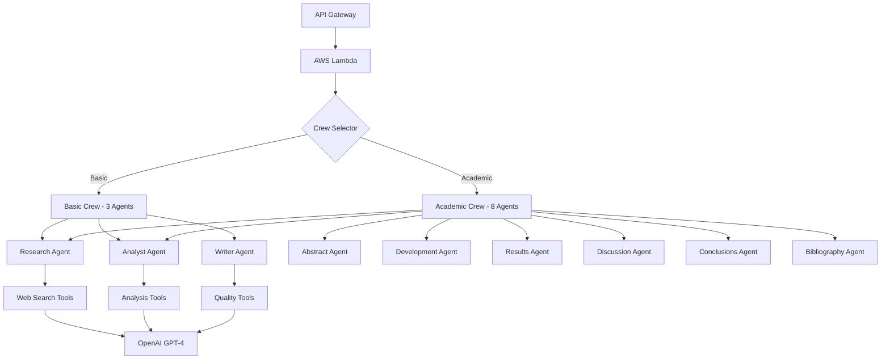

# 🚀 CrewAI Content Marketing Intelligence

[](https://aws.amazon.com/lambda/)
[](https://github.com/joaomdmoura/crewAI)
[](https://openai.com/)
[](https://www.python.org/)
[](LICENSE)

> **Sistema inteligente de generación de contenido para marketing digital usando CrewAI y múltiples agentes especializados**

Un sistema avanzado de IA que utiliza múltiples agentes especializados para generar contenido de marketing de alta calidad, desde artículos de blog hasta papers académicos completos.

## 📋 Tabla de Contenidos

- [🎯 Características Principales](#-características-principales)
- [🏗️ Arquitectura del Sistema](#️-arquitectura-del-sistema)
- [⚡ Quick Start](#-quick-start)
- [🔧 Instalación Completa](#-instalación-completa)
- [🚀 Uso del API](#-uso-del-api)
- [📊 Comparación de Crews](#-comparación-de-crews)
- [🛠️ Herramientas Disponibles](#️-herramientas-disponibles)
- [💰 Costos Estimados](#-costos-estimados)
- [🔍 Ejemplos Prácticos](#-ejemplos-prácticos)
- [📁 Estructura del Proyecto](#-estructura-del-proyecto)
- [🚨 Troubleshooting](#-troubleshooting)
- [🤝 Contribuir](#-contribuir)

## 🎯 Características Principales

### 🚀 **Sistema Dual de Generación**
- **Crew Básico** (3 agentes): Contenido rápido para blogs y web (10-15 min)
- **Crew Académico** (8 agentes): Documentos técnicos y whitepapers (20-30 min)

### 🤖 **8 Agentes Especializados**
- **🔍 Research Agent**: Investigación exhaustiva con búsqueda web
- **🧠 Analyst Agent**: Análisis estratégico y síntesis de datos
- **📋 Abstract Agent**: Resúmenes ejecutivos y keywords SEO
- **✍️ Writer Agent**: Escritura profesional con validación de calidad
- **📊 Results Agent**: Análisis de datos y hallazgos
- **💭 Discussion Agent**: Implicaciones estratégicas y trabajos futuros
- **🎯 Conclusions Agent**: Síntesis final y recomendaciones
- **📚 Bibliography Agent**: Referencias académicas completas

### 🛠️ **8 Herramientas Avanzadas**
- **Búsqueda Web**: Integración con Serper API para investigación actualizada
- **Análisis de Contenido**: Evaluación de keywords, sentimiento y estructura
- **Validación de Datos**: Verificación de estadísticas y fuentes
- **Control de Calidad**: Scoring académico y recomendaciones
- **Formato Múltiple**: Blog, académico, whitepaper, reportes
- **Exportación**: HTML, Markdown y otros formatos
- **Fact Checking**: Detección de sesgos y verificación de afirmaciones

### 🎯 **Casos de Uso**
- **Blog Posts**: Artículos engaging para web corporativa
- **Whitepapers**: Documentos técnicos para lead generation
- **Research Papers**: Análisis académicos profundos
- **Executive Reports**: Reportes estratégicos para C-level
- **Social Content**: Posts optimizados para redes sociales

## 🏗️ Arquitectura del Sistema



## ⚡ Quick Start

### 1. **Deploy Rápido con AWS SAM**

```bash
# Clonar el repositorio
git clone https://github.com/tu-usuario/crewai-content-marketing.git
cd crewai-content-marketing

# Configurar variables de entorno
export OPENAI_API_KEY="tu-openai-api-key"
export SERPER_API_KEY="tu-serper-api-key"

# Deploy con SAM
sam build
sam deploy --guided
```

### 2. **Primera Prueba**

```bash
# Generar artículo de blog (crew básico)
curl -X POST "https://tu-api-url/generate" \
  -H "Content-Type: application/json" \
  -d '{
    "action": "generate_article",
    "crew_type": "basic",
    "format_type": "blog",
    "topic": "IA en Marketing Digital 2025"
  }'
```

## 🔧 Instalación Completa

### **Requisitos Previos**

- Python 3.11+
- AWS CLI configurado
- OpenAI API Key
- Serper API Key (para búsquedas web)

### **Instalación Local**

```bash
# 1. Clonar repositorio
git clone https://github.com/tu-usuario/crewai-content-marketing.git
cd crewai-content-marketing

# 2. Crear entorno virtual
python -m venv venv
source venv/bin/activate  # En Windows: venv\Scripts\activate

# 3. Instalar dependencias
pip install -r requirements.txt

# 4. Configurar variables de entorno
cp .env.example .env
# Editar .env con tus API keys
```

### **Configuración de APIs**

#### **OpenAI API**
1. Crear cuenta en [OpenAI Platform](https://platform.openai.com/)
2. Generar API key en [API Keys](https://platform.openai.com/api-keys)
3. Agregar `OPENAI_API_KEY=tu-key` a variables de entorno

#### **Serper API** (Búsquedas Web)
1. Registrarse en [Serper.dev](https://serper.dev/)
2. Obtener API key gratuita (2,500 búsquedas/mes)
3. Agregar `SERPER_API_KEY=tu-key` a variables de entorno

### **Deploy en AWS**

#### **Opción 1: AWS SAM (Recomendado)**

```bash
# Instalar SAM CLI
# https://docs.aws.amazon.com/serverless-application-model/latest/developerguide/install-sam-cli.html

# Deploy
sam build
sam deploy --guided

# Seguir las instrucciones interactivas:
# - Stack name: crewai-content-marketing
# - AWS Region: us-east-1
# - Confirmar cambios: Y
# - Allow SAM to create IAM roles: Y
```

#### **Opción 2: Serverless Framework**

```bash
# Instalar Serverless
npm install -g serverless

# Deploy
serverless deploy

# Obtener endpoint
serverless info
```

## 🚀 Uso del API

### **Endpoints Disponibles**

| Endpoint | Método | Descripción |
|----------|--------|-------------|
| `/health` | GET | Health check del sistema |
| `/status` | GET | Estado de agentes y configuración |
| `/generate` | POST | Generación de contenido |

### **Parámetros de Generación**

```json
{
  "action": "generate_article",
  "crew_type": "basic|academic",
  "format_type": "blog|academic|whitepaper|report",
  "topic": "Tu tema específico (opcional)"
}
```

#### **crew_type**
- `"basic"`: Crew de 3 agentes (10-15 min)
- `"academic"`: Crew de 8 agentes (20-30 min)

#### **format_type**
**Para Crew Básico:**
- `"blog"`: Artículo de blog casual
- `"web"`: Contenido web corporativo
- `"social"`: Posts para redes sociales

**Para Crew Académico:**
- `"academic"`: Paper académico completo
- `"whitepaper"`: Whitepaper corporativo
- `"report"`: Reporte ejecutivo
- `"research"`: Documento de investigación

### **Respuesta del API**

```json
{
  "success": true,
  "message": "Artículo generado exitosamente",
  "crew_type": "basic",
  "format_type": "blog",
  "topic": "IA en Marketing Digital",
  "result": {
    "outputs": {
      "research": "...",
      "analysis": "...",
      "final_article": "..."
    }
  },
  "metadata": {
    "agents_used": 3,
    "execution_time": "12 minutos",
    "estimated_length": "4,200 palabras"
  }
}
```

## 📊 Comparación de Crews

| Aspecto | Crew Básico | Crew Académico |
|---------|-------------|----------------|
| **⏱️ Tiempo** | 10-15 minutos | 20-30 minutos |
| **📏 Longitud** | 3,000-5,000 palabras | 6,000-10,000 palabras |
| **🤖 Agentes** | 3 agentes | 8 agentes especializados |
| **📚 Referencias** | 5-10 fuentes | 25-50 fuentes académicas |
| **🎯 Ideal para** | Blogs, web, social | Papers, whitepapers, reportes |
| **💰 Costo aprox** | $2-6 USD | $6-14 USD |
| **👥 Audiencia** | General, consumidor | Especializada, B2B |
| **📱 Optimización** | Mobile-first | Desktop/PDF |

### **Cuándo Usar Cada Crew**

#### 🚀 **Crew Básico**
```
✅ Blog posts regulares
✅ Contenido de actualidad
✅ Social media content
✅ Newsletters
✅ Contenido educativo básico
✅ Audiencia general
✅ Publicación frecuente
```

#### 🎓 **Crew Académico**
```
✅ Whitepapers técnicos
✅ Research papers
✅ Reportes ejecutivos
✅ Análisis competitivos
✅ Contenido premium/gated
✅ Thought leadership
✅ Lead generation B2B
```

## 🛠️ Herramientas Disponibles

### **🔍 Investigación y Búsqueda**
- **WebSearchTool**: Búsqueda web con Serper API
- **ContentAnalyzerTool**: Análisis de contenido encontrado

### **📊 Análisis Avanzado**
- **AdvancedContentAnalyzer**: Keywords, sentiment, estructura
- **ContentQualityChecker**: Scoring de calidad (0-100)

### **📝 Formato y Exportación**
- **ArticleFormatterTool**: Múltiples formatos de output
- **DocumentExporter**: HTML, Markdown, PDF

### **✅ Validación y Control**
- **DataValidatorTool**: Verificación de estadísticas y fuentes
- **FactCheckerTool**: Detección de sesgos y fact-checking

## 💰 Costos Estimados

### **Por Artículo**

| Componente | Crew Básico | Crew Académico |
|------------|-------------|----------------|
| **OpenAI API** | $2-5 | $5-12 |
| **Serper API** | $0.25-0.50 | $0.50-1.00 |
| **AWS Lambda** | $0.05-0.15 | $0.15-0.50 |
| **🎯 Total** | **$2.30-5.65** | **$5.65-13.50** |

### **Optimización de Costos**
- Usa crew básico para el 80% del contenido
- Implementa caching para temas similares  
- Monitorea usage con CloudWatch
- Considera modelos locales para testing

### **Escalas de Volumen**
- **1-10 artículos/mes**: Individual/Startup
- **10-100 artículos/mes**: PYME ($50-500/mes)
- **100+ artículos/mes**: Enterprise ($500+/mes)

## 🔍 Ejemplos Prácticos

### **1. Blog Post para Startup Tech**

```bash
curl -X POST "https://api.tudominio.com/generate" \
  -H "Content-Type: application/json" \
  -d '{
    "action": "generate_article",
    "crew_type": "basic",
    "format_type": "blog",
    "topic": "Cómo implementar IA en tu startup sin quebrar el presupuesto"
  }'
```

**Output esperado:**
- ⏱️ 12 minutos de generación
- 📝 3,800 palabras
- 🎯 7 secciones prácticas
- 💡 15 consejos accionables

### **2. Whitepaper B2B Enterprise**

```bash
curl -X POST "https://api.tudominio.com/generate" \
  -H "Content-Type: application/json" \
  -d '{
    "action": "generate_article", 
    "crew_type": "academic",
    "format_type": "whitepaper",
    "topic": "ROI de la Automatización en Content Marketing: Estudio Comparativo 2024"
  }'
```

**Output esperado:**
- ⏱️ 28 minutos de generación
- 📝 8,500 palabras
- 📊 35 estadísticas con fuentes
- 📋 12 secciones especializadas
- 📚 42 referencias académicas

### **3. Reporte Ejecutivo para C-Level**

```bash
curl -X POST "https://api.tudominio.com/generate" \
  -H "Content-Type: application/json" \
  -d '{
    "action": "generate_article",
    "crew_type": "academic", 
    "format_type": "report",
    "topic": "Estrategia de Content Marketing 2025: Roadmap para Transformación Digital"
  }'
```

**Output esperado:**
- 📈 Executive summary
- 🎯 5 recomendaciones estratégicas
- 💰 Budget allocation sugerido
- ⏰ Timeline de implementación
- 📊 KPIs y métricas clave

## 📁 Estructura del Proyecto

```
crewai-content-marketing/
├── 📄 README.md                    # Este archivo
├── 📄 requirements.txt             # Dependencias Python
├── 📄 template.yaml               # AWS SAM template
├── 📄 serverless.yml              # Serverless Framework config
├── 🐍 lambda_function.py          # Función principal Lambda
├── 📁 agents/                     # Agentes especializados
│   ├── 🔍 research_agent.py       # Investigación
│   ├── 🧠 analyst_agent.py        # Análisis estratégico  
│   ├── ✍️ writer_agent.py         # Escritura (crew básico)
│   ├── 📋 abstract_keywords_agent.py # Abstract y SEO
│   ├── 📝 desarrollo_agent.py      # Desarrollo de contenido
│   ├── 📊 resultados_agent.py      # Análisis de resultados
│   ├── 💭 discusion_agent.py       # Discusión e implicaciones
│   ├── 🎯 conclusiones_agent.py    # Conclusiones finales
│   └── 📚 bibliografia_agent.py    # Referencias bibliográficas
├── 🛠️ tools/                      # Herramientas especializadas
│   ├── 🔍 web_search_tool.py      # Búsqueda web
│   ├── 📊 content_analyzer.py     # Análisis de contenido
│   ├── 📝 article_formatter.py    # Formateo de artículos
│   └── ✅ data_validator.py       # Validación de datos
├── 👥 crew/                       # Configuración de crews
│   ├── 🎓 content_crew.py         # Crew académico (8 agentes)
│   └── 🚀 basic_content_crew.py   # Crew básico (3 agentes)
├── ⚙️ config/                     # Configuraciones
│   └── 📋 settings.py             # Settings de agentes y modelos
├── 📝 examples/                   # Ejemplos de uso
│   ├── 🧪 test_local.py           # Testing local
│   ├── 📱 client_example.py       # Cliente Python
│   ├── 💻 curl_examples.sh        # Ejemplos con curl
│   └── 🛠️ tools_usage_example.py  # Uso de herramientas
└── 📚 docs/                       # Documentación adicional
    ├── 🚀 deployment_guide.md     # Guía de deploy
    ├── 🔧 api_reference.md        # Referencia del API
    └── 🛠️ tools_documentation.md  # Documentación de herramientas
```

## 🚨 Troubleshooting

### **Errores Comunes**

#### **🔑 API Keys no configuradas**
```bash
Error: OPENAI_API_KEY not found
```
**Solución:**
```bash
export OPENAI_API_KEY="tu-key-aqui"
export SERPER_API_KEY="tu-serper-key"
```

#### **⏰ Timeout en Lambda**
```bash
Error: Task timed out after 900.00 seconds
```
**Solución:**
```yaml
# En template.yaml
Timeout: 1800  # 30 minutos
MemorySize: 2048  # 2GB RAM
```

#### **💾 Memoria insuficiente**
```bash
Error: Runtime exited with error: signal: killed
```
**Solución:**
```yaml
# Aumentar memoria en template.yaml
MemorySize: 2048  # o 3008 para casos extremos
```

#### **🌐 Error de búsqueda web**
```bash
Error: SERPER_API_KEY no configurada
```
**Solución:**
1. Registrarse en [Serper.dev](https://serper.dev/)
2. Obtener API key gratuita
3. Configurar variable de entorno

### **Logs y Debugging**

```bash
# Ver logs en tiempo real
aws logs tail /aws/lambda/crewai-content-marketing --follow

# Filtrar por tipo de crew
aws logs filter-log-events \
  --log-group-name "/aws/lambda/crewai-content-marketing" \
  --filter-pattern "crew_type: basic"

# Filtrar errores
aws logs filter-log-events \
  --log-group-name "/aws/lambda/crewai-content-marketing" \
  --filter-pattern "ERROR"
```

### **Performance Tuning**

#### **Para Crew Básico**
```python
# En basic_content_crew.py
# Reducir número de búsquedas
search_tool._run(query="...", num_results=5)  # En lugar de 10

# Usar análisis rápido
analyzer._run(content="...", analysis_type="keywords")  # En lugar de "comprehensive"
```

#### **Para Crew Académico**
```python
# Aumentar memoria y timeout
Timeout: 1800
MemorySize: 3008

# Optimizar context entre tareas
self.task.context = [previous_task]  # Solo tareas necesarias
```

## 🤝 Contribuir

### **Cómo Contribuir**

1. **Fork** el repositorio
2. **Crea** una branch para tu feature (`git checkout -b feature/nueva-funcionalidad`)
3. **Commit** tus cambios (`git commit -am 'Agrega nueva funcionalidad'`)
4. **Push** a la branch (`git push origin feature/nueva-funcionalidad`)
5. **Abre** un Pull Request

### **Tipos de Contribuciones**

- 🐛 **Bug fixes**
- ✨ **Nuevas features**
- 📚 **Documentación**
- 🧪 **Tests**
- 🎨 **Mejoras de UI/UX**
- ⚡ **Optimizaciones de performance**

### **Desarrollo Local**

```bash
# Setup para desarrollo
git clone https://github.com/tu-usuario/crewai-content-marketing.git
cd crewai-content-marketing

# Instalar dependencias de desarrollo
pip install -r requirements-dev.txt

# Ejecutar tests
python -m pytest tests/

# Linting
black .
flake8 .
```

### **Crear Nuevos Agentes**

```python
# Plantilla para nuevo agente
from crewai import Agent, Task
from config.settings import ModelConfig

class NuevoAgent:
    def __init__(self, model_config: ModelConfig):
        self.model_config = model_config
        
    def create_agent(self) -> Agent:
        return Agent(
            role="Tu Rol",
            goal="Tu objetivo",
            backstory="Tu historia",
            tools=[...],  # Herramientas necesarias
            llm=self.model_config.get_default_model()
        )
    
    def create_task(self, agent: Agent) -> Task:
        return Task(
            description="Descripción detallada de la tarea",
            expected_output="Output esperado",
            agent=agent
        )
```

### **Crear Nuevas Herramientas**

```python
# Plantilla para nueva herramienta
from crewai_tools import BaseTool
from pydantic import BaseModel, Field

class NuevaHerramientaInput(BaseModel):
    param: str = Field(..., description="Descripción del parámetro")

class NuevaHerramienta(BaseTool):
    name: str = "Nueva Herramienta"
    description: str = "Descripción de qué hace la herramienta"
    args_schema: type[BaseModel] = NuevaHerramientaInput
    
    def _run(self, param: str) -> str:
        # Implementar funcionalidad
        return "Resultado"
```

## 📜 Licencia

Este proyecto está licenciado bajo la Licencia MIT - ver el archivo [LICENSE](LICENSE) para detalles.

## 🙏 Agradecimientos

- **[CrewAI](https://github.com/joaomdmoura/crewAI)** - Framework de agentes cooperativos
- **[OpenAI](https://openai.com/)** - Modelos de lenguaje GPT-4
- **[Serper](https://serper.dev/)** - API de búsqueda web
- **[AWS Lambda](https://aws.amazon.com/lambda/)** - Infraestructura serverless

## 📞 Soporte

- 📧 **Email**: soporte@tudominio.com
- 💬 **Discord**: [Tu servidor de Discord]
- 🐛 **Issues**: [GitHub Issues](https://github.com/tu-usuario/crewai-content-marketing/issues)
- 📖 **Wiki**: [GitHub Wiki](https://github.com/tu-usuario/crewai-content-marketing/wiki)

---

<div align="center">

**🚀 ¡Potencia tu content marketing con IA! 🚀**

[](https://github.com/tu-usuario/crewai-content-marketing)
[](https://demo.tudominio.com)
[](https://docs.tudominio.com)

</div>